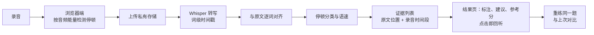

# 开口 Kai-Kou

[](https://github.com/Liyilin66/kai-kou/actions/workflows/test.yml)

**PTE 口语练习工具。** 朗读（RA）和复述句子（RS）基于真实录音逐词诊断：标出漏读、可能读错、犹豫和长停顿，每一处都能点开回听核验，再给出一个按官方规则换算、可追溯依据的 10–90 参考分。

在线体验：<https://www.yli.cc.cd>


<sub>RA 诊断结果页（手机）。左：参考分及其依据；中：原文逐词标注，点词即可回听；右：练习建议，每条都链接到可回听的证据。示例由本地诊断代码生成，识别结果为构造样例，不含用户信息。</sub>

## 为什么做

常见的口语练习工具是"语音识别 → 大模型读文字打分"。模型听不到声音，看不到停顿，只能根据一段可能已经识别错的文字去猜，所以：

- **同一段录音，结论差很多。** 同一条 RA 录音，浏览器识别标出 9 处问题、完整度 84%；Whisper 识别只标出 1 处、完整度 98%。旧方案按浏览器的文字给出的内容分是 58。
- **分数跟着模型变。** 水平相近的朗读，因为主备模型不同，总分相差约 20 分（6 次练习的观察，样本很小）。
- **分数没法核验。** 用户只拿到一个数字，不知道扣在哪里，也没法判断它对不对。

问题不在提示词，而在输入：分数缺少可以核验的依据。所以这个项目的思路是**先拿出证据，再给分**。

## 怎么做



- **逐词对齐**：把转写和原文逐词比对，归一化数字、年代、货币、同音词、复合词、英美拼写和缩写，避免把"读对了但写法不同"算成错误。
- **证据**：每条证据记录类型、原文位置、录音时间段。结果页的原文标注、练习建议、证据列表都指向同一组编号，点哪里都能跳到那段录音。
- **参考分**：按 Pearson 官方 Score Guide 的规则换算。内容按逐词错误计（RA，第 15 页）或按 0–3 档（RS，第 16 页）；流利度按 0–5 档（第 46 页），由犹豫、重复、长停顿和语速决定；内容为 0 时直接给最低分（第 8 页）。总分 = round(10 + 80 × (0.5 × 内容 + 0.5 × 流利度 / 5))，两项权重和 10–90 换算是项目自定，规则页写明了哪些是官方、哪些是项目自定。详见 [评分规则](docs/ra-scoring-rules.md)。
- **重练对比**：同一题再读一次，按位置列出"已改善"和"仍需练习"。

## 关键取舍

- **规则判断，模型不打分。** 对齐、停顿、语速、错误类型、参考分全部由确定性代码计算，同一段录音每次结果一致。
- **识别不确定时不下结论。** 同音词和低置信度位置不算用户错误。替换类问题只写"可能读错或识别不清"，因为识别结果不同，不等于用户读错。
- **发音不评分，明说"本版本未评估"。** 通用识别模型会按语境把读错的词"纠正"回来，文本对齐看不到发音问题。试接过 Azure 发音评估，没过事先定好的门槛，所以不上线，也不拿模型猜的数字充当发音分。
- **停顿用音频能量检测。** Whisper 会把停顿吸收进相邻词的时长，按时间戳算停顿不可靠，所以停顿和开口延迟在浏览器端按音频能量计算，再与对齐结果合并。
- **先定门槛，没过就不上线。** LLM 练习建议评测 3 轮，平均最终通过率 33%、78% 的建议和模板相同，没达到事先定的门槛（通过率 ≥ 80%、与模板相同 ≤ 30%），改用由证据直接生成的模板。DI（描述图表）的内容自动判定稳定性 71.4%，没到 80% 的门槛，DI 暂不开放。

## 评测：浏览器识别 vs Whisper

7 条真实 RA 录音，48 个人工听音确认的位置。"报错"指原文位置被对齐标记为有问题。

| 识别来源 | 报错精确率 | 召回率 | 误报 | 位置准确率 |
|---|---:|---:|---:|---:|
| 浏览器 Web Speech API | 27.7%（13/47） | 100.0%（13/13） | 34 | 29.2%（14/48） |
| Groq Whisper large-v3 | **71.4%（5/7）** | 38.5%（5/13） | **2** | **79.2%（38/48）** |

误报从 34 降到 2。召回率只有 38.5%：漏掉的 8 处，Whisper 的转写都和原文一样，文本对齐发现不了，这正是"发音未评估"的原因。

停顿检测：在 5 条构造录音上，命中 4/5 个预设停顿（召回率 80%）。

**局限：** 只有 1 位说话人、48 个位置；候选位置由两套识别结果挑出，数字不是全文词准确率，也不能推广到其他用户。完整口径和逐条数据见 [评测报告](docs/ra-diagnosis-eval.md)。

## 用户试用

10 位试用者在现场用 RA 诊断练习，随后当场访谈（共用作者的手机和账号，所以行为数据不能按人统计，只看访谈）。

- **最常用的是"点标记回听"**："不用自己拖进度条找位置"，比只告诉"流利度不好"更容易知道该练哪里。
- **分数只是参考**：受访者不会拿它推算考试分数，更看重"正确多少词"和"哪里停了"。
- **"可能读错或识别不清"的说法被接受**：受访者会先回听，再判断是不是自己读错。

根据反馈改了 5 处展示：流利度档位直接写出依据和含义；练习建议附上证据所在的短语；原文上方提示"点标出的词可回听"；断句处的长停顿单独说明；"已改善"提示回听确认。评分规则没有改。详见 [试用报告](docs/user-trial-report.md)。

## 当前范围

| 题型 | 评分方式 |
|---|---|
| RA 朗读句子、RS 复述句子 | 录音诊断 + 参考分（本项目的主线） |
| RL 复述讲座、RTS 情景回应 | 识别文字 + LLM 评分，发音显示"本版本未评估" |
| WE 写作议论文 | 规则检查（字数、结构）+ LLM 评分 |
| WFD 听写句子 | 逐词比对计分 |
| DI 描述图表 | 未开放（内容判定没过门槛） |

另有 AI 私教（按练习记录给建议）、学习报告、重练对比和会员试用。RS 的 60 道题为原创，音频用 Azure 语音合成生成，没有使用第三方题库。

## 下一步

- **召回率低**：接入按原文的发音评估，捕捉被识别模型"纠正"掉的错误；需要先过评测门槛。
- **"我确认读对了"**：让用户标记误报，积累识别误差样本，用于下一轮评测。
- **下一轮试用**：每人用自己的账号，按人统计回听、重练和回访。
- **扩展题型**：把录音诊断推广到 RTS、DI。

## 工程实践

- **发布流程**：`main` 推送即自动部署。日常开发在 `lyl` 分支，改动线上行为的提交经独立审查后才合并；新功能用开关控制，先在预览环境验收。
- **CI**：GitHub Actions 运行全部测试，并在诊断开关全开、全关两种状态下各构建一次。
- **幂等写库**：诊断结果由服务端保存，以 `attempt_id` 为幂等键，重复提交直接返回已有结果，不重复调用识别服务。
- **结果可追溯**：每条结果记录识别模型、诊断规则版本、评分版本和建议版本，历史结果可以解释，新旧方案可以对比。
- **模型主备切换**：评分 LLM 在超时、网络错误和 401/402/403/404/429/5xx 时切到备用模型；请求本身有误（400/413/422）时不切换。
- **数据库保活**：每天一次定时健康检查，防止 Supabase 免费项目因无活动被暂停。

## 技术栈

Vue 3 · Vite · Tailwind CSS · Vercel Serverless · Supabase（Postgres、Storage、行级权限）· Groq Whisper · Node `node:test`

## 本地运行

```bash
npm install
npm run dev        # 前端
npm run dev:api    # 本地 API
npm test
```

环境变量、数据库脚本和部署说明见 [开发与部署](docs/development.md)。

## 文档

| 文档 | 内容 |
|---|---|
| [评分规则](docs/ra-scoring-rules.md) | 官方规则逐条注明页码，以及项目自定的换算 |
| [评测报告](docs/ra-diagnosis-eval.md) | 识别对比、停顿检测的口径与逐条数据 |
| [试用报告](docs/user-trial-report.md) | 访谈结论、改动和数据局限 |
| [改进方案](docs/improvement-plan.md) | 整体路线与每一步的取舍 |
| [界面规范](docs/ui-guidelines.md) | 色板、组件和手机 / 电脑布局规则 |
| [任务记录](docs/tasks/) | 每项改动的任务说明、验收与审查记录 |
